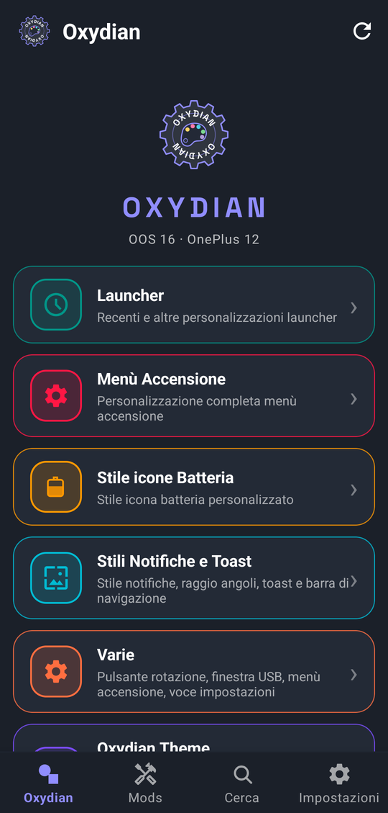
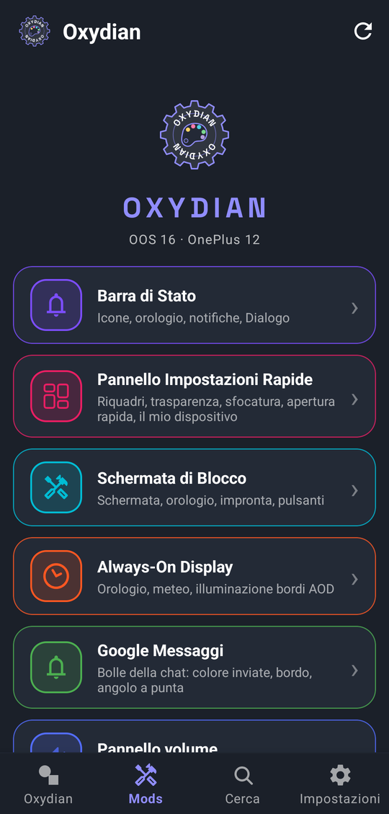
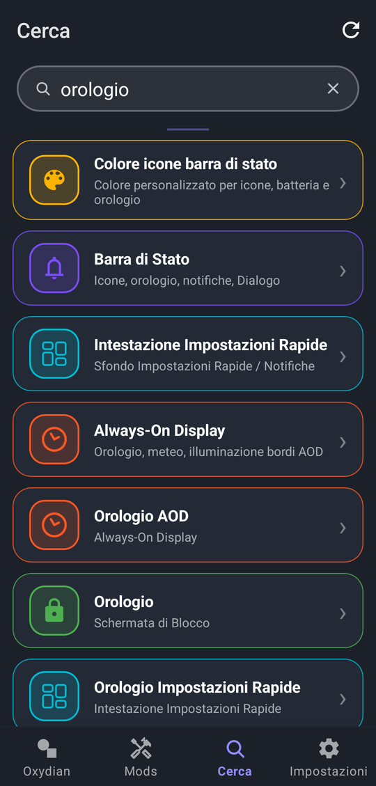
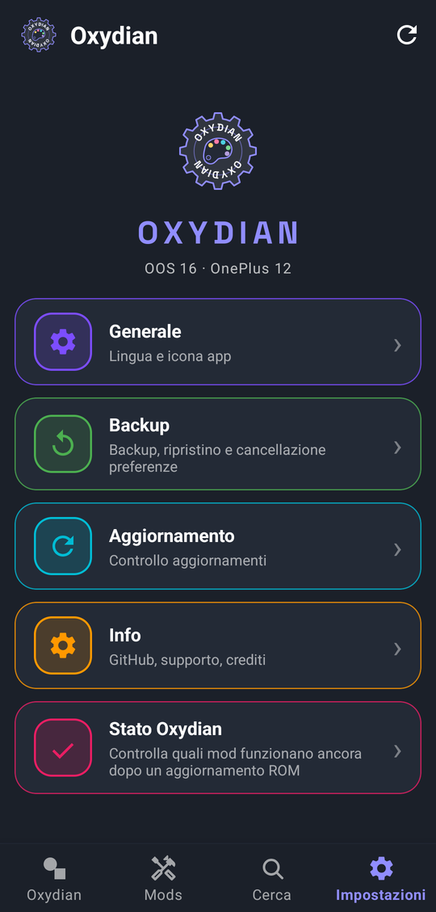
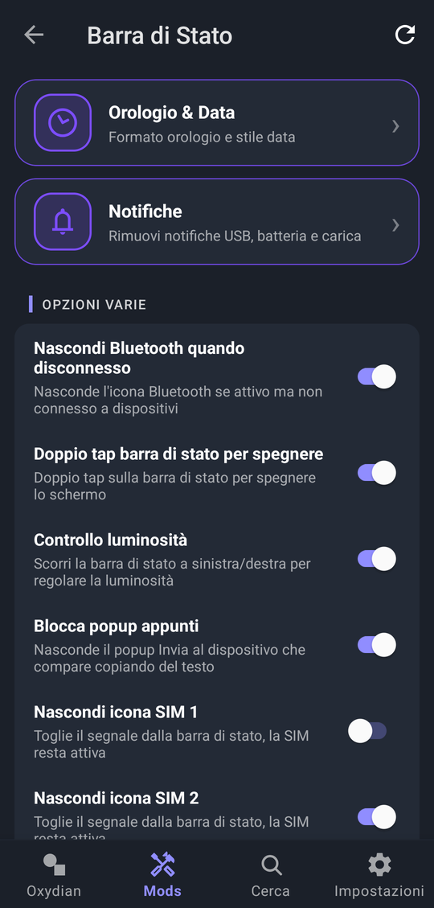
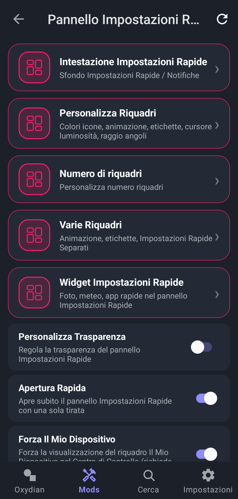
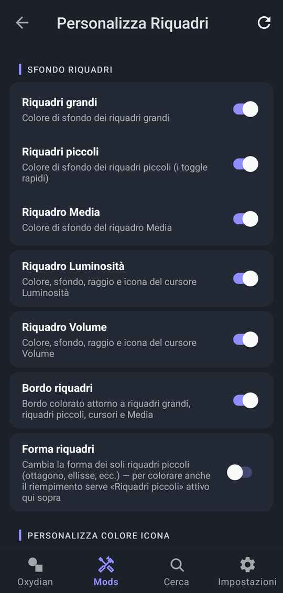
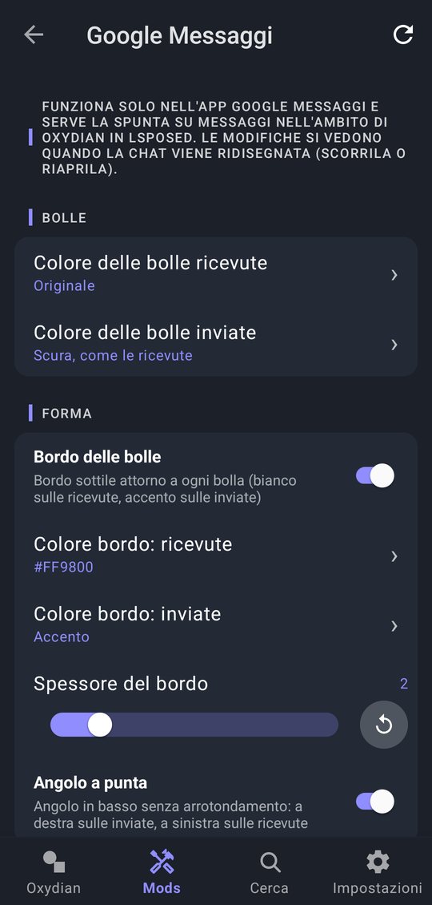
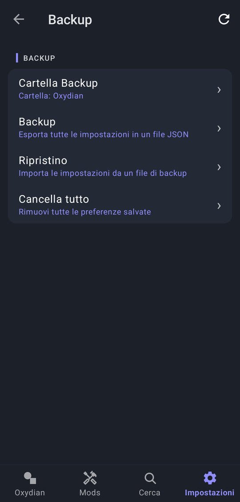
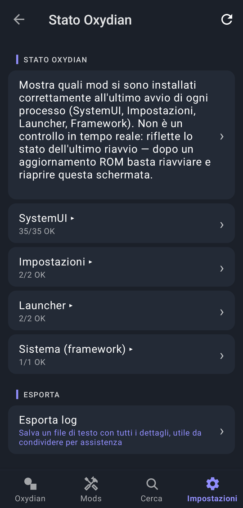

# Oxydian — Tutorial

🌐 [English](TUTORIAL.md) · **Italiano** · [← Torna al README](../README.it.md)

Una guida passo passo: dall'installazione alle prime personalizzazioni.

---

## 1. Cosa serve

- Un telefono **OnePlus / OPPO** con **OxygenOS** (provato su OnePlus 12, OxygenOS 16.1), Android 12 o successivo
- **Root**: KernelSU, KernelSU Next o Magisk
- **LSPosed** (o un altro framework Xposed) installato e funzionante
- Facoltativa ma consigliata: l'app compagna **[Oxydian Theme](https://github.com/tugaia56/Oxydian-Theme/releases/latest)**. Non richiede Xposed e si occupa dei veri temi overlay (colori di accento e sfondo, temi per le app, icone, tastierino del PIN…). Oxydian legge i colori scelti lì, quindi le due app danno il meglio insieme.

> Oxydian è pensato per il **tema scuro**. Con il tema chiaro alcune mod dell'aspetto del sistema (stili notifica, toast, dialog) restano spente e l'aspetto originale non viene toccato. Vedi [Tema chiaro](#8-tema-chiaro).

---

## 2. Installazione

1. Scarica l'ultimo APK di **Oxydian** dalla pagina [Releases](https://github.com/tugaia56/Oxydian-xposed/releases/latest) e installalo.
2. Apri **LSPosed → Moduli**, trova **Oxydian** e **attivalo**.
3. Apri il modulo e controlla il suo **ambito** (le app in cui lavora). I quattro essenziali sono:
   - `android` (Framework di sistema)
   - `com.android.systemui` (SystemUI)
   - `com.android.settings` (Impostazioni)
   - `com.android.launcher` (Launcher)

   Le altre app dell'elenco sono facoltative: servono solo a colorare gli sfondi delle schede dentro quelle app. Lasciale come sono, a meno che tu non sappia di non averne bisogno.
4. **Riavvia** il telefono. È necessario la prima volta e anche dopo ogni aggiornamento dell'APK di Oxydian: il solo riavvio di SystemUI può continuare a usare il codice vecchio.
5. Apri Oxydian e concedi l'accesso **root** quando richiesto.

---

## 3. Giro veloce dell'app

In basso ci sono quattro schede: **Oxydian**, **Mods**, **Cerca** e **Impostazioni**.

  
  
  
  

Il pulsante a forma di freccia circolare, in alto a destra in ogni pagina, è **Riavvia SystemUI**: serve per applicare le modifiche (vedi più avanti).

### Oxydian (prima scheda)

| Voce | A cosa serve |
|---|---|
| **Launcher** | Recenti e altre modifiche al launcher: colonne e righe, cartelle (compresa la *chiusura automatica delle cartelle*), dock, layout della home |
| **Menù Accensione** | Personalizzazione completa del menù di spegnimento: colori, sfondi, riavvio avanzato (recovery, bootloader, riavvio SystemUI, screenshot…) con autenticazione facoltativa |
| **Stile icone Batteria** | Icone batteria e icona di ricarica personalizzate |
| **Stili Notifiche e Toast** | Stile delle notifiche, texture, bordi, raggio degli angoli, toast e barra di navigazione |
| **Varie** | Navigazione a gesti, pulsante di rotazione, dialog USB, abilita screenshot e altro |
| **Oxydian Theme** | Scorciatoia all'app compagna (accento, sfondo, icone, tastierino PIN, temi per le app) |

### Mods

| Voce | A cosa serve |
|---|---|
| **Barra di Stato** | Icone, orologio, opzioni notifiche, stili batteria, nascondi un'icona SIM (SIM 1 e SIM 2 separate) |
| **Pannello Impostazioni Rapide** | Sfondo e forma dei riquadri, immagine e orologio dell'intestazione, widget, trasparenza e sfocatura |
| **Schermata di Blocco** | Widget, orologio, meteo, copertina musicale, icona impronta, pulsanti |
| **Always-On Display** | Orologio AOD, meteo, luce sui bordi |
| **Google Messaggi** | Aspetto delle bolle della chat di Google Messaggi: colori, bordo, angolo a punta (vedi il [capitolo 5](#5-google-messaggi-bolle-della-chat)) |
| **Pannello volume** | Colori e preset dei pulsanti |

Esempio di pagina: **Barra di Stato**, con le opzioni varie (tra cui nascondi icona SIM 1 e SIM 2):

### Cerca

Scrivi una parola (per esempio *orologio* o *sfocatura*) e Oxydian trova tutte le opzioni corrispondenti in tutta l'app. Tocca un risultato per andarci direttamente.

### Impostazioni

| Voce | A cosa serve |
|---|---|
| **Generale** | Lingua, tema dell'app (chiaro / scuro / sistema), scheda predefinita, log aggiuntivi |
| **Backup** | Salva, ripristina o azzera tutte le tue preferenze |
| **Aggiornamento** | Controlla se c'è una nuova versione (a mano o in automatico, solo con Wi-Fi) |
| **Info** | Versione e crediti |
| **Stato Oxydian** | Mostra quali mod si sono installate correttamente all'ultimo avvio di ogni processo (SystemUI, Impostazioni, Launcher, Framework) |

---

## 4. La tua prima personalizzazione

Cambiamo qualcosa che si vede subito.

1. Vai in **Mods → Pannello Impostazioni Rapide**.
2. Apri **Personalizza Riquadri** e scorri fino a **Sfondo Riquadri**: qui scegli il colore dei riquadri (grandi, piccoli, Media…).
3. Tocca l'icona **Riavvia SystemUI** (la freccia circolare in alto a destra).
4. Scorri verso il basso il pannello rapido: il nuovo aspetto è lì.

  
  

### Applicare le modifiche

- La maggior parte delle mod si applica dopo **Riavvia SystemUI**. Lo schermo diventa nero per un paio di secondi e poi torna: è normale.
- Alcune opzioni agiscono su altre parti del sistema (**Launcher**, **Impostazioni**, **framework**) e possono richiedere un **riavvio**. Se un'opzione sembra non funzionare, riavvia una volta prima di pensare che sia rotta.
- Molte pagine ti ricordano quando serve un riavvio ("Riavvia SystemUI per applicare").

---

## 5. Google Messaggi: bolle della chat

Oxydian può cambiare l'aspetto delle bolle della chat di **Google Messaggi**. È una mod Xposed, quindi serve un passaggio in più:

1. In **LSPosed → Moduli → Oxydian**, spunta **Messaggi** (Google Messaggi) nell'ambito.
2. Chiudi e riapri Messaggi.

Poi apri **Mods → Google Messaggi**:

- **Bolle**
  - *Colore delle bolle ricevute*: originale, oppure un colore a scelta.
  - *Colore delle bolle inviate*: originale, scuro come le ricevute, il colore di accento al 50 % di trasparenza, oppure un colore a scelta (anche trasparente). Il testo diventa chiaro o scuro da solo per restare leggibile.
- **Forma**
  - *Bordo delle bolle*: un bordo sottile attorno a ogni bolla, con un colore diverso per ricevute e inviate (l'accento o un colore a scelta) e uno spessore regolabile.
  - *Angolo a punta*: l'angolo in basso è a punta, a destra sulle bolle inviate e a sinistra su quelle ricevute. Anche gli angoli di unione tra bolle consecutive sono a punta.

Le modifiche si vedono quando la chat viene ridisegnata: scorrila un po' o riaprila. Se non cambia niente, controlla che Messaggi sia spuntato in LSPosed e riavvia l'app.

> La mod segue il modo in cui Google disegna oggi le bolle. Se un aggiornamento di Messaggi lo cambia, le bolle tornano semplicemente all'aspetto originale.

---

## 6. Colori: Oxydian + Oxydian Theme

Oxydian non ridipinge da solo tutto il sistema. I colori di sistema (accento e sfondo) si scelgono in **Oxydian Theme**, che costruisce veri overlay; Oxydian usa poi lo stesso accento per le sue mod (bordi, riquadri, menù di accensione…).

Ordine consigliato:

1. Installa **Oxydian Theme**, scegli accento e sfondo, applica, riavvia.
2. Apri Oxydian e personalizza il resto: segue l'accento che hai scelto.

---

## 7. Backup e ripristino

Prima di fare molte prove, salva le impostazioni.

1. Vai in **Impostazioni → Backup**.
2. **Cartella Backup** sceglie dove salvare i file.
3. **Backup** esporta tutte le impostazioni in un file `.json`. Il nome del file contiene data e ora, così distingui i backup.
4. **Ripristino** apre la scelta del file: seleziona un backup e le preferenze tornano come prima.
5. **Cancella tutto** rimuove tutte le preferenze salvate.

Tieni una copia del backup fuori dal telefono (cloud o PC) prima di installare di nuovo una ROM da zero.

---

## 8. Tema chiaro

Oxydian è compatibile al 100 % con il **tema scuro**. Con il sistema in tema chiaro:

- l'interfaccia dell'app funziona anche in chiaro;
- le mod che hanno senso solo sullo scuro (stili notifica, toast, dialog) restano **spente** e l'aspetto originale di OxygenOS non viene toccato.

Per il risultato migliore tieni Android in tema scuro.

---

## 9. Se qualcosa non va

| Problema | Cosa fare |
|---|---|
| Una mod non fa niente | Riavvia una volta. Poi apri **Impostazioni → Stato Oxydian** (vedi sotto) e controlla che la mod risulti funzionante. |
| Dopo un aggiornamento della ROM alcune mod non vanno più | OxygenOS può rinominare parti interne. Stato Oxydian mostra quali sono coinvolte; aggiorna Oxydian e segnala il problema con il log. |
| L'interfaccia si riavvia in continuazione | In LSPosed **disattiva Oxydian** (o togli i suoi ambiti), riavvia, poi riattiva le mod un gruppo alla volta. |
| Le opzioni sembrano invariate dopo aver installato una nuova versione di Oxydian | Fai un **riavvio** completo (non solo di SystemUI). |
| La richiesta di root non compare | Controlla che Oxydian sia autorizzato nel gestore root (KernelSU / Magisk). |

**Stato Oxydian** mostra, per ogni processo, quante mod sono partite correttamente (qui: SystemUI 35/35, Impostazioni 2/2, Launcher 2/2, Sistema 1/1). C'è anche **Esporta log**, utile da allegare a una segnalazione.

Per segnalare un bug, attiva **Impostazioni → Generale → Log aggiuntivi**, riproduci il problema e apri una [segnalazione](https://github.com/tugaia56/Oxydian-xposed/issues) descrivendo cosa hai fatto, il dispositivo e la versione di OxygenOS.

---

## 10. Da sapere

- Oxydian nasce dal lavoro di **Oxygen Customizer** di Luigi (@LC9889); vedi i crediti nel README.
- Ogni versione ha note di rilascio bilingue (inglese / italiano) nella pagina Releases.
